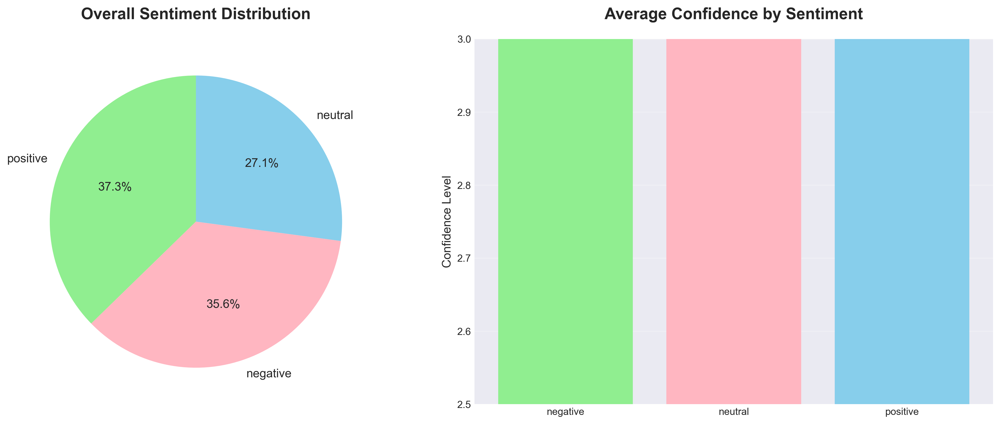
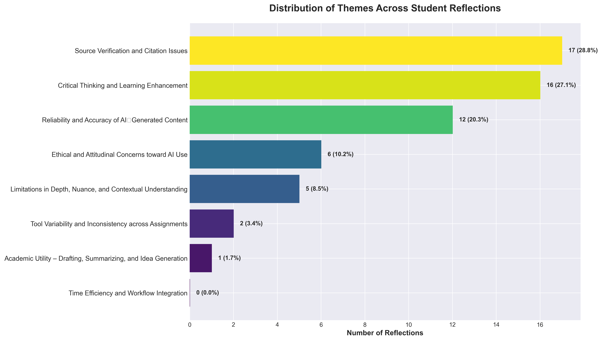
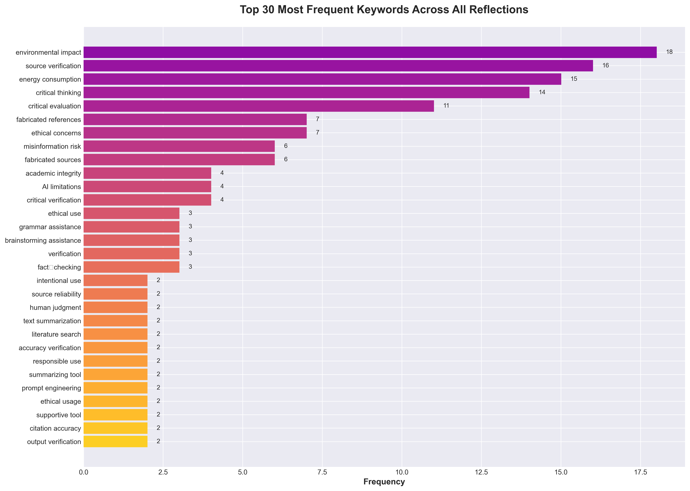
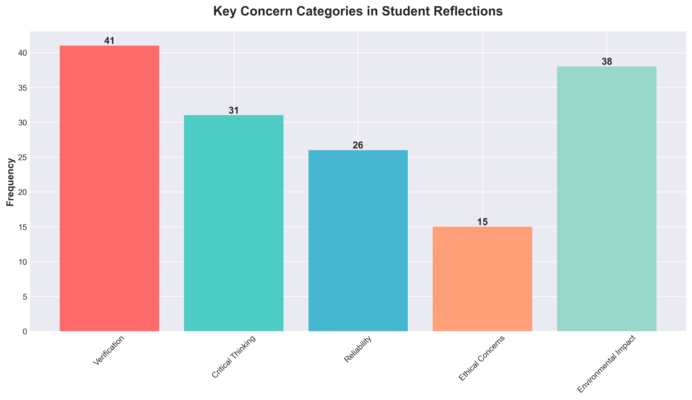
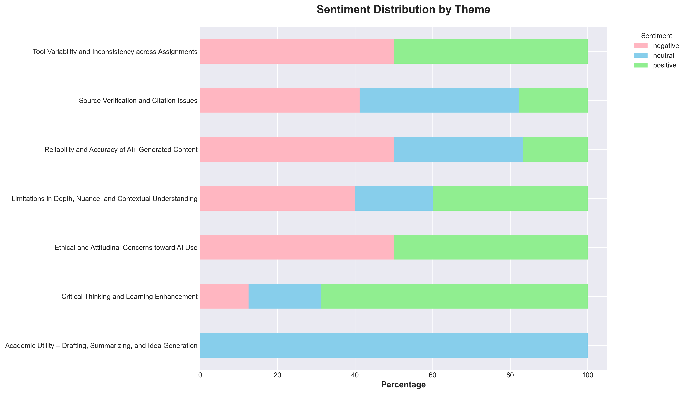

# Qualitative Analysis of Student Reflections on GenAI in Academic Work

This pipeline analyzes student reflections about using generative AI in academic writing. I built it to process 59 reflections from a university course where students experimented with ChatGPT and Perplexity for academic assignments.

## What I Found

Students had surprisingly balanced views—37.3% positive, 35.6% negative, and 27.1% neutral. The dominant concern across nearly 29% of reflections was source verification. Students kept discovering that AI fabricates references that look legitimate but don't exist. This forced them to check every citation manually, which often took longer than just finding sources themselves.

Interestingly, 27% of reflections emphasized how working with AI actually improved their critical thinking. When students had to verify AI outputs against real sources, they ended up engaging more deeply with the literature than they might have otherwise. The process of catching AI mistakes became its own learning experience.

Environmental impact came up more than I expected—it was the most frequently mentioned keyword with 18 occurrences, even though the assignments didn't specifically focus on sustainability. Students genuinely care about AI's carbon footprint.







The charts show eight emergent themes from the clustering analysis. Source verification dominated (28.8% of reflections), followed closely by critical thinking and learning enhancement (27.1%). The keyword analysis reveals students talked most about environmental impact (18 mentions), source verification (16), and energy consumption (15). 

What's interesting in the sentiment-by-theme breakdown is that reflections about critical thinking were overwhelmingly positive—students valued the deeper analytical work—while reliability concerns skewed negative, which makes sense given the trust issues around fabricated content.

## How It Works

The pipeline runs five analysis steps using either a local LLM (Ollama with deepseek-r1:7b) or Azure OpenAI:

**Step 1: Keyword Extraction** – Pulls out 3-5 key concepts from each reflection  
**Step 2: Sentiment Analysis** – Classifies sentiment (positive/negative/neutral) with confidence scores  
**Step 3: Analytic Memos** – Generates short summaries capturing learning shifts and insights  
**Step 4: Thematic Clustering** – Uses two-pass LLM clustering to identify emergent themes  
**Step 5: Audit Trail** – Logs all prompts and responses for transparency  

Everything outputs to CSV files, and there's a separate script (`analyze_results.py`) that generates the matplotlib visualizations.

## Installation and Usage

Clone the repo and activate the virtual environment:
```bash
git clone <repository-url>
cd Analysis-of-Student-Reflections-on-GenAI-in-Academic-Work
source myenv/bin/activate  # or myenv\Scripts\activate on Windows
pip install -r requirements.txt
```

If you're using Ollama locally:
```bash
ollama serve
ollama pull deepseek-r1:7b
```

Run the full analysis:
```bash
python main.py analyze
```

Or run individual steps:
```bash
python main.py step1  # keywords only
python main.py step2  # sentiment only
# etc.
```

Generate visualizations:
```bash
python analyze_results.py
```

### Input Formats

The pipeline accepts text files, CSV, or JSON. For text files, place your reflections in `data/reflections/reflections.txt` separated by `---`. For CSV or JSON, edit `config.yaml` to specify the format and which column/field contains the text.

## Configuration

Edit `config.yaml` to switch between Ollama and Azure OpenAI, adjust model parameters, change file paths, or modify analysis settings like the number of themes or keywords per reflection.

## Project Structure

```
Analysis-of-Student-Reflections-on-GenAI-in-Academic-Work/
├── data/reflections/        # Input data goes here
├── src/                     # Analysis step modules
│   ├── step1_keywords.py
│   ├── step2_sentiment.py
│   ├── step3_memos.py
│   ├── step4_clustering.py
│   └── step5_audit.py
├── output/
│   ├── results/            # CSV outputs
│   ├── analysis/           # Charts and reports
│   └── audit/              # Complete logs
├── main.py                 # Main entry point
├── analyze_results.py      # Visualization generator
└── config.yaml             # Configuration file
```

## Requirements

Python 3.9+, Ollama with deepseek-r1:7b (or an Azure OpenAI API key), 8GB+ RAM recommended.

## For Educators

If you're teaching courses about AI in academic work, this analysis suggests a few things worth emphasizing:

First, teach source verification as a core skill. Students will discover AI fabricates references, but they need to learn how to catch this systematically—checking DOIs, looking up author credentials, verifying journal names.

Second, frame AI as something that can actually enhance critical thinking rather than replace it. When students have to compare AI outputs with real sources, they engage more deeply with the material. The verification process itself becomes pedagogical.

Third, acknowledge the ethical and environmental dimensions. Students are already thinking about AI's carbon footprint and academic integrity implications. Having explicit conversations about these issues validates their concerns and helps develop more responsible use patterns.

## Methodology Notes

This uses LLM-powered thematic analysis with a hybrid inductive-deductive approach. All sentiment classifications achieved high confidence ratings. The audit trail logs every prompt and response, so the analysis is fully reproducible. I validated themes against the raw reflection text rather than just accepting the LLM's categorizations at face value.

## License

MIT License. See LICENSE file for details.

## Contributing

If you want to extend this, some areas that could use work: additional visualization types, support for more LLM providers, multi-language support, or adding inter-rater reliability metrics for validation.

