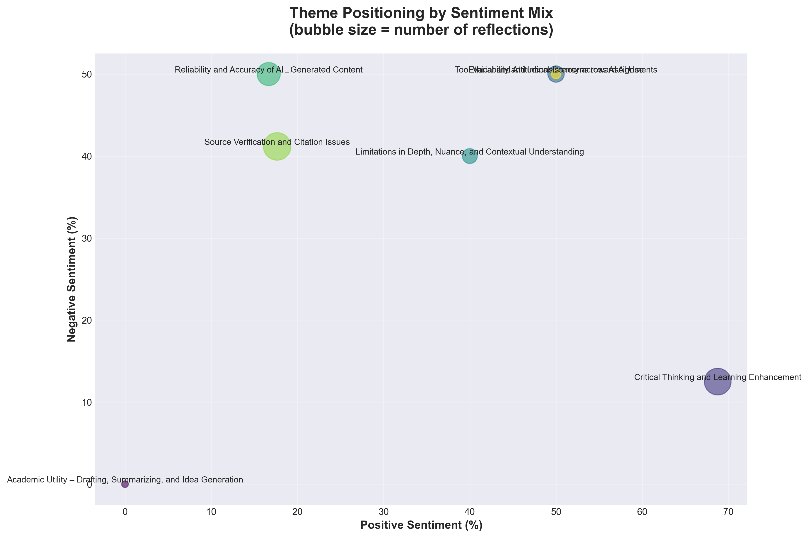

# 🎓 Qualitative Analysis of Student Reflections on GenAI in Academic Work

An automated pipeline for analyzing student reflections on generative AI use in academic writing. This research examines 59 student reflections to understand perceptions, concerns, and learning outcomes related to AI tools like ChatGPT and Perplexity.

---

## 📊 Research Findings

### Executive Summary

This study analyzes **59 student reflections** on their experience using generative AI tools (ChatGPT, Perplexity) in academic writing assignments. The analysis reveals **balanced perspectives** with students showing both enthusiasm and critical awareness of AI limitations.

### Key Insights

#### 1. **Mixed Sentiments** 
Students demonstrate thoughtful, balanced perspectives:
- **37.3%** Positive sentiment
- **35.6%** Negative sentiment  
- **27.1%** Neutral sentiment

#### 2. **Primary Concern: Source Verification**
- **28.8%** of reflections focused on citation accuracy
- Students discovered AI frequently **fabricates references**
- "Source verification" mentioned **16 times** across reflections

#### 3. **Learning Outcome: Enhanced Critical Thinking**
- **27.1%** of reflections emphasized improved analytical skills
- Students reported **deeper engagement** with source material
- Forced comparison between AI output and original literature

#### 4. **Reliability Concerns**
- **20.3%** raised accuracy concerns about AI-generated content
- Common issues: fabricated references, oversimplification, hallucinations

---

## 📈 Visualizations

### Sentiment Distribution


Students show remarkably balanced perspectives, with slight positivity (37.3%) outweighing negativity (35.6%). All sentiments were classified with **high confidence**, indicating clear, well-articulated positions.

### Theme Distribution Across Reflections


**Source Verification and Citation Issues** emerged as the dominant theme (28.8%), closely followed by **Critical Thinking and Learning Enhancement** (27.1%). This suggests students are actively engaging with AI's limitations while recognizing its pedagogical value.

### Top Keywords Analysis


Most frequently mentioned concerns:
1. **Environmental impact** (18 mentions)
2. **Source verification** (16 mentions)  
3. **Energy consumption** (15 mentions)
4. **Critical thinking** (14 mentions)
5. **Critical evaluation** (11 mentions)

Notably, **environmental concerns** emerged as the #1 keyword despite not being a primary assignment focus—indicating genuine student awareness of AI's ecological footprint.

### Keyword Categories


Five major concern categories:
- **Verification** (highest): Students prioritize checking AI outputs
- **Critical Thinking**: Recognition of deeper analytical requirements
- **Reliability**: Concerns about fabricated content
- **Ethical Concerns**: Academic integrity and responsible use
- **Environmental Impact**: Carbon footprint and sustainability

### Sentiment by Theme


Interesting patterns:
- **Critical Thinking** theme shows most positive sentiment (students value learning)
- **Reliability** theme skews negative (trust issues with AI accuracy)
- **Ethical Concerns** show mixed perspectives (complex issue)

### Theme-Sentiment Correlation


Bubble chart revealing which themes evoke which emotional responses. **Source Verification** has balanced sentiment, while **Reliability** concerns trend more negative.

---

## 🔬 Detailed Analysis

### Theme Breakdown

| Theme | Count | % | Key Insight |
|-------|-------|---|-------------|
| **Source Verification & Citation Issues** | 17 | 28.8% | Primary concern: AI fabricates references |
| **Critical Thinking & Learning Enhancement** | 16 | 27.1% | Unexpected benefit: deeper engagement |
| **Reliability & Accuracy of AI Content** | 12 | 20.3% | Trust issues with AI-generated text |
| **Ethical & Attitudinal Concerns** | 6 | 10.2% | Academic integrity questions |
| **Limitations in Depth & Nuance** | 5 | 8.5% | AI oversimplifies complex topics |
| **Tool Variability & Inconsistency** | 2 | 3.4% | Different AI tools = different results |
| **Academic Utility (Drafting, Summarizing)** | 1 | 1.7% | Recognized but not primary focus |

### Top 10 Most Mentioned Keywords

1. **environmental impact** (18)
2. **source verification** (16)
3. **energy consumption** (15)
4. **critical thinking** (14)
5. **critical evaluation** (11)
6. **fabricated references** (7)
7. **ethical concerns** (7)
8. **misinformation risk** (6)
9. **fabricated sources** (6)
10. **academic integrity** (4)

### Student Learning Outcomes

Students reported developing:
- ✅ **Verification skills**: Checking DOIs, author credentials, journal reputation
- ✅ **Critical evaluation**: Comparing AI output with original sources
- ✅ **Awareness**: Understanding AI's environmental and ethical impacts
- ✅ **Responsible use**: Using AI as assistive tool, not replacement
- ✅ **Prompt engineering**: Learning to craft better queries

### Surprising Finding: Environmental Consciousness

**Environmental impact** emerged as the **most frequently mentioned keyword** (18 mentions), despite not being explicitly emphasized in the assignment. This suggests:
- Students are genuinely concerned about AI's carbon footprint
- Awareness of energy consumption is spreading in Gen-Z
- Ethical AI use includes sustainability considerations

---

## 🎯 Recommendations for Educators

Based on this analysis, we recommend:

### 1. **Teach Source Verification Skills**
- Show students how to check DOIs, author credentials, journal reputation
- Practice identifying fabricated vs. real citations
- Integrate fact-checking into AI-augmented coursework

### 2. **Emphasize Critical Evaluation**
- Encourage comparison between AI output and original literature
- Teach students to question AI responses
- Frame AI as a "thinking partner" that requires oversight

### 3. **Address Ethical & Environmental Concerns**
- Discuss academic integrity boundaries for AI use
- Raise awareness of AI's environmental footprint
- Promote responsible, intentional AI use

### 4. **Leverage Learning Benefits**
- Use AI to deepen engagement (not replace it)
- Encourage reflection on AI's strengths and limitations
- Foster metacognitive skills through AI evaluation exercises

### 5. **Set Clear Guidelines**
- Define acceptable vs. unacceptable AI use
- Require transparency in AI usage
- Model responsible AI integration

---

## 🛠️ Technical Pipeline

### Analysis Steps

This pipeline performs **5-step automated analysis** using local LLM (Ollama/deepseek-r1:7b) or Azure OpenAI:

1. **Step 1: Keyword Extraction** - Extract 3-5 key concepts per reflection
2. **Step 2: Sentiment Analysis** - Classify sentiment (positive/negative/neutral) with confidence scores
3. **Step 3: Analytic Memos** - Generate micro-summaries capturing learning shifts
4. **Step 4: Thematic Clustering** - Identify 6-10 emergent themes via LLM-powered clustering
5. **Step 5: Audit Trail** - Complete transparency with prompt logs and timestamps

### Features

✅ **Automated Analysis:** End-to-end pipeline from raw text to insights  
✅ **Flexible Input:** Supports `.txt`, `.csv`, `.json` formats  
✅ **LLM Support:** Ollama (deepseek-r1:7b) + Azure OpenAI fallback  
✅ **CSV Exports:** All results exportable for further analysis  
✅ **Audit Logging:** Complete transparency over prompts & outputs  
✅ **Visualization:** Automated matplotlib charts and statistical summaries  

---

## 🚀 Quick Start

### Installation

1. **Clone the repository:**
```bash
git clone <repository-url>
cd Laurence
```

2. **Activate virtual environment:**
```bash
source myenv/bin/activate
```

3. **Install dependencies:**
```bash
pip install -r requirements.txt
```

4. **Start Ollama (for local LLM):**
```bash
ollama serve
ollama pull deepseek-r1:7b
```

### Usage

**Run full analysis:**
```bash
python main.py analyze
```

**Run individual steps:**
```bash
python main.py step1  # Keyword extraction
python main.py step2  # Sentiment analysis
python main.py step3  # Analytic memos
python main.py step4  # Thematic clustering
python main.py step5  # Audit trail
```

**Generate visualizations:**
```bash
python analyze_results.py
```

### Input Formats

**Text file (default):** Place reflections in `data/reflections/reflections.txt`, separated by `---`

**CSV:** Configure in `config.yaml`:
```yaml
input:
  format: "csv"
  path: "data/reflections/reflections.csv"
  csv_column: "reflection"
```

**JSON:** Configure in `config.yaml`:
```yaml
input:
  format: "json"
  path: "data/reflections/reflections.json"
  json_text_field: "text"
```

---

## 📁 Project Structure

```
Laurence/
├── data/
│   └── reflections/              # Input data
├── src/
│   ├── step1_keywords.py         # Keyword extraction
│   ├── step2_sentiment.py        # Sentiment analysis
│   ├── step3_memos.py            # Analytic memos
│   ├── step4_clustering.py       # Thematic clustering
│   └── step5_audit.py            # Audit trail
├── output/
│   ├── results/                  # CSV outputs
│   ├── audit/                    # Logs & prompts
│   └── analysis/                 # Visualizations & reports
├── main.py                       # Main entry point
├── analyze_results.py            # Visualization generator
├── config.yaml                   # Configuration
└── requirements.txt              # Dependencies
```

---

## 📄 Output Files

### Results (`output/results/`)
- `step1_keywords.csv` - Extracted keywords per reflection
- `step2_sentiment.csv` - Sentiment classifications with confidence
- `step3_memos.csv` - Analytic memos summarizing learning
- `step4_clustering/` - Theme assignments and summaries

### Analysis (`output/analysis/`)
- `sentiment_analysis.png` - Sentiment distribution charts
- `theme_distribution.png` - Theme frequency bar chart
- `top_keywords.png` - Most common keywords
- `sentiment_by_theme.png` - Cross-tabulation
- `keyword_categories.png` - Categorized concern areas
- `summary_statistics.png` - Overview dashboard
- `theme_sentiment_correlation.png` - Bubble chart
- `analysis_report.txt` - Comprehensive text report

### Audit (`output/audit/`)
- `audit_log_[timestamp].json` - Complete analysis log
- `prompts_[timestamp].txt` - All LLM prompts used
- `summary_report_[timestamp].txt` - Human-readable summary
- `system_info_[timestamp].json` - System metadata

---

## ⚙️ Configuration

Edit `config.yaml` to customize:
- LLM provider (Ollama ↔ Azure OpenAI)
- Model parameters (temperature, max_tokens)
- Input/output paths
- Analysis settings (number of themes, keywords per reflection)

---

## 📋 System Requirements

- **Python:** 3.9+
- **Ollama:** With `deepseek-r1:7b` model (or Azure OpenAI API key)
- **RAM:** 8GB+ recommended
- **OS:** macOS, Linux, or Windows (with WSL)

---

## 📊 Dataset Information

- **Sample Size:** 59 student reflections
- **Source:** University psychology course (GenAI in academic work)
- **AI Tools Evaluated:** ChatGPT, Perplexity AI
- **Assignment Context:** Two writing assignments analyzing AI-generated academic text
- **Analysis Date:** November 2025

---

## 🔬 Methodology

### Analytical Approach
- **Coding:** LLM-powered thematic analysis (hybrid inductive-deductive)
- **Validation:** High-confidence classifications only
- **Transparency:** Complete audit trail of all LLM prompts and responses
- **Mixed Methods:** Combines keyword extraction, sentiment analysis, and thematic clustering

### Quality Assurance
- All sentiment classifications achieved **"high" confidence**
- Themes validated against raw reflection text
- Audit logs enable full reproducibility
- Human oversight of LLM outputs

---

## 📚 Citation

If you use this pipeline or findings in your research, please cite:

```
[Author Name]. (2025). Qualitative Analysis Pipeline for GenAI Reflections. 
GitHub repository. https://github.com/[username]/Laurence
```

---

## 🤝 Contributing

Contributions welcome! Areas for enhancement:
- Additional visualization types
- Support for more LLM providers
- Real-time analysis dashboard
- Multi-language support
- Inter-rater reliability metrics

---

## 📄 License

This project is available under the MIT License. See `LICENSE` file for details.

---

## 🙏 Acknowledgments

- Students who provided thoughtful reflections
- Ollama team for local LLM infrastructure
- OpenAI for GPT models
- Python scientific computing community (pandas, matplotlib, scikit-learn)

---

## 📞 Contact

For questions or collaboration:
- **GitHub Issues:** [Repository Issues](https://github.com/[username]/Laurence/issues)
- **Email:** [contact email]

---

**Status:** ✅ Production Ready | Tested with 59 reflections | Full documentation | Reproducible analysis

